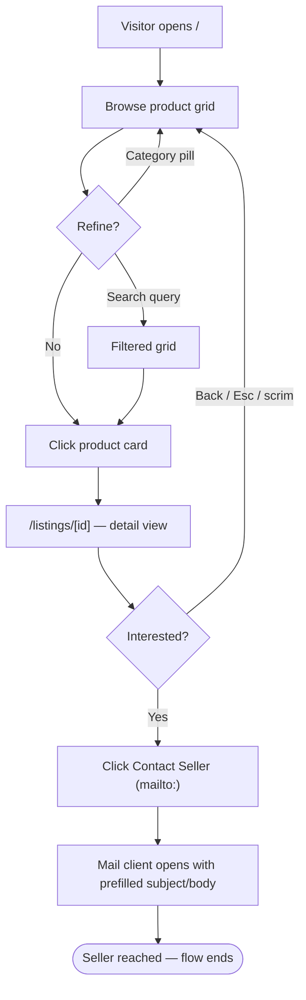
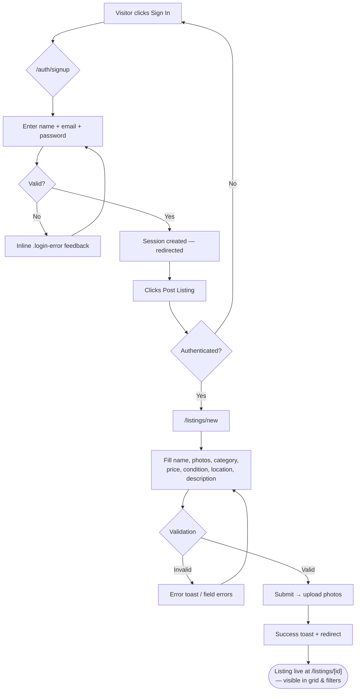

# Thrift & Co. — Design Specification (MVP, NEXUS-Sprint)

**Source of truth**: `deepseek_html_20260819_5af3e2.html` (single-file prototype)
**Target stack**: Next.js App Router — prototype CSS custom properties ported directly as a global stylesheet. **No Tailwind.**
**Scope**: browse/search listings · listing detail · post-a-listing (photo upload) · email/password auth · contact seller via `mailto:` link.

> All token values below are quoted verbatim from the prototype's `:root` and `[data-theme="dark"]` blocks and its component CSS. Nothing is invented; where the MVP requires an element the prototype lacks (search field, photo dropzone, mailto CTA, public auth pages), the spec maps it onto existing tokens/components and is flagged **[NEW]**.

---

## 1. Design Tokens

Port these 1:1 into a global stylesheet (e.g. `app/globals.css`). Dark theme overrides only what is listed in `[data-theme="dark"]`; everything else inherits from `:root`.

### 1.1 Color variables — Light (`:root`) vs Dark (`[data-theme="dark"]`)

| Token | Light value | Dark value | Usage in prototype |
|---|---|---|---|
| `--bg-primary` | `#f6f4f0` | `#181614` | Page background |
| `--bg-secondary` | `#ffffff` | `#221f1c` | Cards, header, modals, sidebar |
| `--bg-elevated` | `#f0ede8` | `#2c2824` | Image placeholders, table headers, badges, theme-toggle track |
| `--bg-input` | `#faf9f7` | `#2c2824` | Form inputs |
| `--text-primary` | `#1a1816` | `#f0ece6` | Headings, titles, prices |
| `--text-secondary` | `#5a5550` | `#b5aea6` | Body copy, labels, meta |
| `--text-muted` | `#8a8580` | `#7a756e` | Locations, hints, empty states |
| `--border-color` | `#e0dbd5` | `#3a3530` | Card/input/divider borders |
| `--accent` | `#b8875a` | `#d4a373` | Primary buttons, active pills/toggles, logo span, scrollbar thumb |
| `--accent-hover` | `#a06f44` | `#c28e5c` | Primary button hover |
| `--accent-light` | `#f0e6db` | `#3a3228` | Hover fills, price chip on detail modal |
| `--danger` | `#c0392b` | *(inherits light)* | Delete buttons, error text, required asterisk, error toast border |
| `--danger-hover` | `#a93226` | *(inherits light)* | Delete button hover |
| `--success` | `#27ae60` | *(inherits light)* | Success toast border, Add Product button |

Dark-theme-only shadow overrides:

| Token | Light value | Dark value |
|---|---|---|
| `--shadow` | `0 4px 24px rgba(26, 24, 22, 0.08)` | `0 4px 24px rgba(0, 0, 0, 0.3)` |
| `--shadow-hover` | `0 8px 40px rgba(26, 24, 22, 0.14)` | `0 8px 40px rgba(0, 0, 0, 0.5)` |

### 1.2 Typography

| Token | Value | Notes |
|---|---|---|
| `--font` | `'Inter', -apple-system, BlinkMacSystemFont, 'Segoe UI', Roboto, sans-serif` | Used on body and all buttons/inputs explicitly |
| `--text-xs` | `0.75rem` | Badges, condition tags, small meta |
| `--text-sm` | `0.875rem` | Buttons, labels, meta, table text |
| `--text-base` | `1rem` | Inputs, card titles |
| `--text-lg` | `1.125rem` | Hero paragraph, prices, modal h3 confirm |
| `--text-xl` | `1.25rem` | Logo, section/modal headings |
| `--text-2xl` | `1.5rem` | Detail title, admin h2, mobile hero h1 |
| `--text-3xl` | `1.875rem` | *(defined; unused in markup)* |
| `--text-4xl` | `2.25rem` | Hero h1 (desktop) |
| body `line-height` | `1.6` | Set on `body` |

Observed heading treatments (not tokens, but fixed values): hero h1 `font-weight:700; letter-spacing:-1px; line-height:1.2`; logo `letter-spacing:-0.5px`; card title `-webkit-line-clamp:2`.

### 1.3 Spacing scale

| Token | Value |
|---|---|
| `--space-1` | `4px` |
| `--space-2` | `8px` |
| `--space-3` | `12px` |
| `--space-4` | `16px` |
| `--space-6` | `24px` |
| `--space-8` | `32px` |
| `--space-12` | `48px` |
| `--space-16` | `64px` |

### 1.4 Radius / shadow / motion

| Token | Value |
|---|---|
| `--radius` | `16px` (cards, modals, login box) |
| `--radius-sm` | `10px` (buttons `.btn`, inputs, toasts, stat cards) |
| `--transition` | `0.25s cubic-bezier(0.23, 1, 0.32, 1)` (product-card hover) |
| `--shadow` | see §1.1 |
| `--shadow-hover` | see §1.1 |

Hardcoded values that recur (document for fidelity; do not tokenize away):

| Where | Value |
|---|---|
| Theme toggle container | `border-radius:24px; padding:3px`, option buttons `border-radius:20px; padding:4px 10px` |
| Pill-shaped controls (cart btn, admin btn, category pills) | `border-radius:24px` |
| Condition tag / cat-badge / detail chips | `border-radius:12px; padding:0 var(--space-2)` or `2px 12px` |
| Qty stepper buttons | `width/height:28px; border-radius:50%` |
| Detail-modal close button | `32px circle; background:var(--bg-elevated)` |
| Button hover lift | `transform:translateY(-1px)`; add-btn press `scale(0.97)`; product-card hover `translateY(-4px)` |
| Accent glow shadows | cart-btn `0 2px 12px rgba(184,135,90,0.25)` → hover `0 4px 20px rgba(184,135,90,0.35)`; theme-toggle active `0 2px 8px rgba(184,135,90,0.3)` |
| Input focus ring | `outline:none; border-color:var(--accent); box-shadow:0 0 0 3px rgba(184,135,90,0.15)` |
| Component transitions (non-token) | `all 0.2s ease` (buttons/pills), `background/border-color 0.3s ease` (theme surfaces), sidebar slide `transform 0.35s cubic-bezier(0.23,1,0.32,1)` |
| Overlay scrims | cart `rgba(0,0,0,0.4)` blur(4px); modal `rgba(0,0,0,0.5)` blur(4px); detail `rgba(0,0,0,0.5)` blur(4px); confirm `rgba(0,0,0,0.5)` blur(4px); admin-login `rgba(0,0,0,0.6)` blur(8px) |
| Header | sticky, `z-index:100`, `backdrop-filter:blur(12px)`, translucent bg `rgba(...,0.85)` — dark hardcoded `rgba(34,31,28,0.85)` |
| Toast animation | `slideUp`: from `opacity:0; translateY(20px) scale(0.96)` over `0.4s cubic-bezier(0.23,1,0.32,1)` |
| Container | `max-width:1240px; margin:0 auto; padding:0 var(--space-4)` |
| Scrollbar (webkit) | width `6px`, track `var(--bg-primary)`, thumb `var(--accent)`, radius `4px` |

### 1.5 Breakpoints (from media queries)

| Breakpoint | Changes |
|---|---|
| base (>768px) | grid `repeat(auto-fill, minmax(240px, 1fr))`, gap `--space-6`; hero h1 `--text-4xl` |
| ≤768px | header padding `--space-2`; logo `--text-lg`; hero h1→`--text-2xl`, p→`--text-base`; grid `minmax(160px,1fr)` gap `--space-4`; form-row → 1 column; cart sidebar full-width |
| ≤480px | grid forced `1fr 1fr` gap `--space-3`; card padding `--space-3`; category pills shrink to `--text-xs` / `--space-1 --space-3` |

### 1.6 Domain vocabularies (carry over exactly)

**Categories (6 + implicit "All" filter):**

| Value | Label in UI |
|---|---|
| `electronics` | 📱 Electronics |
| `furniture` | 🪑 Furniture |
| `books` | 📚 Books |
| `clothing` | 👕 Clothing |
| `home` | 🏠 Home |
| `other` | 🔮 Other |

**Condition scale (7 levels, exact order as in `<select id="fCondition">`):**
`New` · `Like New` · `Excellent` · `Very Good` · `Good` · `Fair` · `Poor`
Fallback default when missing: `"Good"`.

---

## 2. Screen-by-Screen Specification

### 2.1 Home / Browse & Search Listings (`/`)

**Purpose**: Visitor lands here; scan marketplace inventory, filter by category, search by keyword, open any listing.

**Key components** (names match prototype markup):
- `.header` (sticky, translucent, blur) containing `.logo` ("🛍️ Thrift&Co." with accent-colored `&`), `.nav-actions`.
  - MVP navbar composition: `.logo` + `.theme-toggle` + **Sign In button [NEW]** (`.admin-toggle-btn` styling reused: outline pill) + **Post Listing button [NEW]** (`.cart-btn` styling reused: solid accent pill). Cart/Admin controls deferred.
  - **Search input [NEW]**: no search exists in the prototype. Spec: single text input using the `.form-group input` recipe (`padding:var(--space-3)`, `border:1px solid var(--border-color)`, `border-radius:var(--radius-sm)`, `background:var(--bg-input)`, focus ring per §1.4), placed in `.header-inner` or between hero and category bar. Debounced client-side filter over name/description.
- `.hero`: centered; h1 "Find *treasures* that tell a story" (span accent-colored), p subtitle max-width `560px`.
- `.category-bar` of `.category-pill` buttons: `All` + the 6 categories (§1.6). Active pill = accent border/text on `--accent-light`. In Next.js, sync active category to `?category=` search param.
- `.product-grid` of `.product-card`:
  - `.product-image`: square (`aspect-ratio:1/1`), `--bg-elevated` fill, emoji placeholder at `4rem` (mobile `3rem`). **MVP adaptation**: render uploaded photo with `object-fit:cover`; keep emoji fallback (`📦`) for photos-not-yet-loaded / no photo.
  - `.condition-tag`: absolute chip top-left (`top/left:var(--space-2)`), `--bg-secondary` bg, radius `12px`, `--text-xs`, weight 600.
  - `.product-body`: `.title` (base, 600 weight, 2-line clamp), `.meta` row = `.price` (`$X.XX`, lg, 700, with muted `· category` suffix) + location (xs, muted).
  - Prototype's `.add-btn` ("Add to cart") is **deferred** — cards link to `/listings/[id]` instead. Whole card becomes one link target.
- Empty state `.no-products`: 🔍 icon at `4rem`, "**No items in this category**" (lg/500), "Try another filter or check back later." (sm). Reuse verbatim copy for zero search results ("No results for “{query}”").

**States**
- *Empty*: `.no-products` block as above (grid-column `1/-1`).
- *Loading* **[NEW]**: skeleton cards matching `.product-card` geometry (square image block + two text bars) pulsing on `--bg-elevated`. No skeleton exists in prototype; derive purely from tokens.
- *Error* **[NEW]**: full-grid message styled like `.no-products` with ❌ icon and retry `.btn-outline`; surface failure also via error toast (§4, Toast).

**Responsive**: per §1.5 breakpoints (240→160px auto-fill→2-col). Nav actions wrap (`flex-wrap:wrap`).

**Dark mode**: all surfaces flip via tokens; heavier black shadows automatically apply. Photo placeholders stay legible because `--bg-elevated` darkens. Header uses dark hardcoded translucent value.

---

### 2.2 Listing Detail (`/listings/[id]`)

Prototype implements this as a JS-injected overlay (`#detailOverlay`, inline styles, z-index `250`, scrim `rgba(0,0,0,0.5)` + blur(4px)). **MVP ports it to a route** while preserving visual language exactly:

**Layout** (inside a `max-width:480px` panel, `--radius`, `--bg-secondary`, `--shadow-hover`, `padding:var(--space-6)`, `max-height:90vh`, scrollable):
1. Circular close button (32px, `--bg-elevated`, ✕) top-right at `var(--space-3)`.
2. Large image (`4rem` emoji today → full-width photo **[adaptation]**, rounded `--radius-sm`, same `aspect-ratio:1/1` crop).
3. `h2` title — `--text-2xl`, 700.
4. Chip row (`display:flex; gap:var(--space-2); flex-wrap:wrap`): **price chip** on `--accent-light` (`2px 12px`, radius `12px`, sm, 500) · **condition chip** on `--bg-elevated` · **category chip** on `--bg-elevated`.
5. Description paragraph (`--text-secondary`), fallback copy `"No description provided."`.
6. Seller/location line (`--text-sm`, `--text-muted`): `👤 {seller} · 📍 {location}`.
7. CTA row **[replaces Add-to-Cart]**:
   - **Contact Seller** — primary `.btn-primary` full-width (`padding:var(--space-3)`, font-base, 700): renders as `<a href="mailto:{sellerEmail}?subject=...&body=...">`. Pre-fill subject: `Re: {listing title}`; body includes listing title + price. Requires seller email on the listing record **[NEW data field]** — the prototype stores only a display name (`Mike R.`).
   - Secondary "Back to listings" `.btn-outline` (or breadcrumb) optional.
8. Escape key closes (prototype behavior); route-back on close. Scrim click closes.

**States**: loading skeleton mirroring layout; not-found → empty-state pattern ("📦 This listing is no longer available") with link home; contact-seller has no async states (pure `mailto:`).

**Responsive**: panel becomes full-width minus `var(--space-4)` page padding (prototype already does this via overlay padding).

**Dark mode**: chips/panel recolor automatically; ensure price chip text uses `--text-primary` (accent-light is dark in dark mode).

---

### 2.3 Post a Listing (`/listings/new`, auth required)

Adapted directly from the prototype's **Product Modal** (`.modal-box`, `max-width:600px`) rendered as a page instead of an overlay.

**Header**: `.modal-header` pattern — `h3` "Post a Listing" (`--text-xl`, 700), bottom border `--border-color`, close/cancel affordance.

**Fields** (`.form-group` recipe: label sm/500/secondary above input; `margin-bottom:var(--space-4)`):

| Field | Control | Required | Source in prototype |
|---|---|---|---|
| Product Name | text input, placeholder `e.g. Vintage Sony Stereo` | ✅ | `#fName` |
| Photos **[NEW — replaces Emoji]** | multi-photo upload dropzone, previews grid | ≥1 recommended | prototype had `#fEmoji` (maxlength 4). Dropzone style: dashed `1px var(--border-color)`, radius `--radius-sm`, `--bg-input`, hover/focus border `--accent`. Thumbnails square (`aspect-ratio:1/1`), remove ✕ button styled like `.remove-btn` |
| Category | select, exactly the 6 options (§1.6), default `electronics` | ✅ | `#fCategory` |
| Price ($) | number input, `placeholder="0.00"` `min=0` `step=0.01` | ✅ | `#fPrice` |
| Condition | select, exactly the 7 options (§1.6), default `Good` | ✅ | `#fCondition` |
| Location | text input, placeholder `e.g. Brooklyn, NY` | ✅ | `#fLocation` |
| Description | textarea `rows="3"`, `resize:vertical`, `min-height:80px`, optional | — | `#fDescription` |
| Seller | auto-filled from signed-in user profile, read-only display | auto | replaces free-text `#fSeller` |

- Desktop: fields paired in `.form-row` (`grid-template-columns:1fr 1fr; gap:var(--space-4)`); collapses to 1 column ≤768px (existing rule).
- Required marker: red asterisk `label .required { color: var(--danger) }` — keep visual, add screen-reader text (see §5).
- **Form actions footer**: top border, Cancel (`.btn-outline`) + Submit (`.btn-primary`), each `flex:1`, `padding:var(--space-3)`.
- Validation mirrors prototype messages via error toast / inline text: name required, valid non-negative price, location required. Upload progress → button loading/disabled state (`.checkout-btn:disabled` recipe: `opacity:0.5; cursor:not-allowed`).

**States**: pristine / field-errors (danger text, danger border on invalid input) / submitting (disabled submit + spinner) / success → redirect to new `/listings/[id]` + success toast ("✅ \"{name}\" added!" — prototype copy).

**Dark mode**: all inputs use `--bg-input` (#2c2824 in dark); focus ring unchanged (works on both themes); dropzone thumbnails on `--bg-elevated`.

---

### 2.4 Auth — Sign In / Sign Up (`/auth/signin`, `/auth/signup`)

No public auth screens exist in the prototype. Build both from the **Admin Login Box** pattern (`.admin-login-box`), which is the closest existing design:

- Centered card: `max-width:400px`, `--radius`, `--bg-secondary`, `padding:var(--space-8)`, `--shadow-hover`, on a scrim-style page background (use `--bg-primary`, no dimming needed for a standalone page).
- `h2` centered (`--text-2xl`, 700) + supporting `p` centered (sm, secondary) — e.g. "🔐 Welcome back".
- `.form-group` fields stacked, `margin-bottom:var(--space-4)`:
  - Email — `type="email"`, `autocomplete="email"`
  - Password — `type="password"`, `autocomplete="current-password"` (sign-in) / `new-password` (sign-up). Prototype used `autocomplete="off"` for its fake admin gate — do **not** carry that over to real auth.
  - Sign-up adds: Display name (feeds the listing `Seller` field) + Confirm password.
- Full-width submit `.btn-primary` (`padding:var(--space-3)`, `font-size:var(--text-base)`), disabled while pending.
- Error treatment: reuse `.login-error` — hidden by default, shown on failure, `color:var(--danger)`, sm, centered, `margin-top:var(--space-3)`. Copy style: "Incorrect email or password. Please try again."
- Cross-link: "New here? Create an account" / "Have an account? Sign in" — `.btn-outline` full-width below the form (mirrors `.form-actions` split).
- Success → redirect to intended destination (post-listing entry point returns to `/listings/new`).

---

### 2.5 Contact Seller (interaction, not a screen)

Implemented as the `mailto:` anchor defined in §2.2. No backend messaging. Deferred alternative noted in §6.

---

### Deferred screens observed in the prototype (do NOT build)

| Prototype feature | Status |
|---|---|
| Cart Sidebar (`.cart-sidebar`, qty steppers, checkout) | Deferred — payments/cart out of scope |
| Admin Dashboard (stats `.stat-card`, `.admin-table`, edit/delete) | Deferred — admin flows out of scope |
| Admin password gate (`.admin-login-overlay`) | Superseded by real email/password auth |
| Confirm-delete dialog (`.confirm-box`) | Keep as reusable Modal variant (§4) for future delete-my-listing |
| Reviews, favorites, messaging threads | Not present in prototype; deferred |

---

## 3. User Flows

### Flow A — Visitor browses → views listing → contacts seller

### Flow B — New user signs up → posts listing → listing live

---

## 4. Component Inventory (variants observed in prototype)

| Component | Prototype class(es) | Variants observed | MVP usage |
|---|---|---|---|
| **Container** | `.container` | single (max-w 1240px, px-16) | all pages |
| **Navbar/Header** | `.header`, `.header-inner`, `.logo`, `.logo-icon`, `.nav-actions` | sticky translucent; wraps on mobile | all pages |
| **Theme Toggle** | `.theme-toggle`, `.theme-toggle-btn(.active)` | light ☀️ / dark 🌙 (radiogroup w/ aria-checked) | header. Note: prototype has **no "system" option** — preserve 2-option behavior unless PM changes scope |
| **Button** | `.btn` + `.btn-primary` / `.btn-danger` / `.btn-success` / `.btn-outline` / `.btn-sm`; plus one-offs `.add-btn`, `.checkout-btn`, `.cart-btn`, `.admin-toggle-btn` | primary (accent), danger, success, outline, sizes default/sm; pill variants (24px radius) for nav actions | CTAs everywhere; pill variants for header Sign-In / Post Listing |
| **Card** | `.product-card` (+`.product-image`, `.condition-tag`, `.product-body`, `.title`, `.meta`, `.price`) | single listing-card variant; hover lift + accent border | browse grid |
| **Badge/Chip** | `.badge` (cart count), `.condition-tag`, `.condition-badge`, `.cat-badge`, detail chips | neutral (`--bg-elevated`) and accent-light; radius 12px | condition/category/price chips |
| **Category Pill** | `.category-pill(.active)` | default, hover, active | browse filters |
| **Input** | `.form-group` `input` / `select` / `textarea`, `label`, `.required` | text, number (step .01), password, select (category/condition), textarea rows=3 | post-listing + auth forms |
| **Form Row** | `.form-row` | 2-col desktop → 1-col ≤768px | post-listing |
| **Modal** | `.modal-overlay(.visible)`, `.modal-box`, `.modal-header`, `.modal-close`, `.form-actions` | standard (600px); scrim blur(4px); Esc/scrim close; body `no-scroll` | post-listing confirmations, future dialogs |
| **Detail Panel** | `#detailOverlay` (JS-injected) | 480px centered panel, circular close | listing detail route |
| **Auth Card** | `.admin-login-box`, `.login-error(.visible)` | 400px centered, error slot | sign-in/up |
| **Confirm Dialog** | `.confirm-overlay`, `.confirm-box`, `.confirm-actions` | danger-action confirm (Cancel/`btn-danger`) | future destructive actions |
| **Toast** | `.toast-container`, `.toast` + `.success/.info/.error` | 3 semantic variants (left border 4px: success/info/accent, error/danger); icons ✅📌❌; auto-dismiss ~2.8s | global feedback |
| **Empty State** | `.no-products`, `.cart-empty` (+`.empty-icon`) | icon + heading (lg/500) + hint (sm/muted) | grid empty, not-found |
| **Sidebar** (overlay drawer) | `.cart-sidebar`, `.cart-overlay` | right drawer 420px, slide-in | deferred (pattern kept) |
| **Stat Card / Table** | `.stat-card`, `.admin-table-wrap`, `.admin-table`, `.actions-cell` | admin-only | deferred |

---

## 5. Accessibility Notes

Issues found in the prototype (fix during port; visual output must remain identical):

1. **Contrast risks** (WCAG 2.1 AA, approximate computed ratios):
   - White text on light `--accent #b8875a` ≈ **3.2:1** — fails AA for normal-size button text (`--text-sm`); passes large-text threshold only. White on dark `--accent #d4a373` ≈ **2.3:1** — fails outright. *Mitigation without changing brand colors:* bump button font-weight (already 600–700), increase size where possible, or darken light-mode accent for text-bearing fills only; document decision before build.
   - `--text-muted` on `--bg-primary`: ≈ **3.3:1** light / **3.95:1** dark — used for locations/hints at xs/sm sizes; borderline-fail for body-critical info. Keep muted strictly for supplementary meta.
   - `--danger #c0392b` with white ≈ **5.4:1** — passes. `--success` green appears only as a 4px decorative border — acceptable, but never convey status by color alone (toast icons already help).
   - Placeholder text color is UA-default (often < 4.5:1) — verify against `--bg-input`.
2. **Focus states**: inputs have a proper focus ring (accent border + `0 0 0 3px rgba(184,135,90,0.15)`), but **buttons, pills, toggles, and cards define none** — they rely on UA defaults. Port must add a consistent `:focus-visible` ring reusing the input recipe across all interactive elements.
3. **Semantics**:
   - `.product-card` is a clickable `
` — convert to `<a>` wrapping card content so keyboard users can reach listings; remove inner duplicate interactive elements.
   - Product-detail overlay lacks `role="dialog"`, `aria-modal`, labelled heading, and focus trap (cart sidebar has `role="dialog"` — mirror that). Route-based detail largely solves this; still trap focus in Modals.
   - Toast container needs `aria-live="polite"` (`role="status"`); errors should be `role="alert"`.
   - Product-form `<label>`s are **not associated** with inputs (missing `for`/`id`) — fix; admin password field does this correctly (`for="adminPassword"`).
   - Emoji-only controls (☀️/🌙 toggle buttons, ✕ close buttons) need `aria-label`s (toggle container already has `role="radiogroup"` + `aria-checked` management — good pattern to keep).
   - Required asterisk is color-only meaning: keep `.required` visually but mark `aria-hidden="true"` and append sr-only "(required)".
   - Landmarks: `<header>`/`<main>` exist — good. Add `<nav>` around `.nav-actions`, `<footer>`, and `alt=""`/decorative handling for emoji-as-image (`aria-hidden`), real `alt` for listing photos.
4. **Motion**: hover lifts/transitions are subtle; respect `prefers-reduced-motion` by disabling transform animations (token-level addition).
5. **Keyboard parity**: Esc-close exists for all overlays (good); ensure tab order matches visual order once cards become links.

---

## 6. Open Items / Deviations Flagged for Build

- **Search** and **photo upload** do not exist in the prototype — specced above strictly from existing tokens; confirm with PM before implementation.
- **Seller email** must be added to the listing data model for `mailto:` contact (prototype stores display-name only).
- Prototype's `--bg-secondary-rgb` reference in the header CSS is unresolved (falls back to white) — implement header translucency with explicit per-theme rgba values as the dark override already does.
- Theme toggle stays light/dark only (no system preference option) to match prototype unless scope changes.

---

**Spec author**: ArchitectUX agent
**Source file**: `deepseek_html_20260819_5af3e2.html` (read end-to-end; tokens quoted verbatim)
**Handoff**: Ready for LuxuryDeveloper — implement `globals.css` tokens first, then components in §4 order, then screens in §2 order.
